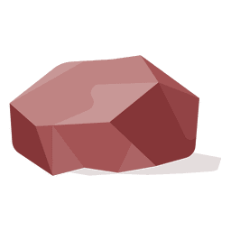

# RedStone: Local Network File Sharing in Pure Rust with GUI

RedStone is a user-friendly application designed for local network file sharing, developed entirely in the Rust programming language. It provides a simple and intuitive interface for both server and client operations.

## Server Tutorial

Follow these steps to set up the RedStone server:

1. Launch the RedStone application.
2. Choose the `Server` option.
3. Select the appropriate network adapter to use for sharing files (if the client and server are on the same Wi-Fi network, choose the Wi-Fi adapter).
4. Wait for the client to initiate the file upload.

## Client Tutorial

To use RedStone as a client to retrieve shared files, follow these instructions:

1. Open the RedStone application.
2. Select the `Client` option.
3. Enter the server's IP address and port in the format IP:Port, and then click "Connect."
4. Choose the file you wish to download.
5. Wait for the upload process to complete.

## Screenshots

Check out these screenshots of the RedStone application in action:

## Contributing

We welcome contributions to RedStone! Before contributing, please read our [Contributing Guidelines](CONTRIBUTING.md) to understand our development process and how to get started.

## License

RedStone is open-source software licensed under the [MIT License](LICENSE). Feel free to use, modify, and distribute it according to the terms of the license.

RedStone simplifies local network file sharing while providing a visual interface that makes it easy for both server and client users. Enjoy seamless file sharing with RedStone, all powered by Rust.
